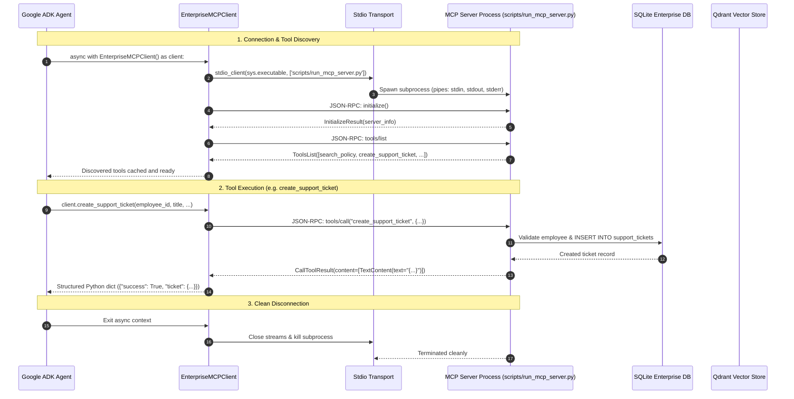

# Model Context Protocol (MCP) Client Architecture

## 1. Overview & Architectural Role

The **`EnterpriseMCPClient`** provides a high-level asynchronous service abstraction enabling the AI Agent orchestrator (Google Agent Development Kit, LangChain, or custom FastAPI controllers) to discover, inspect, and execute enterprise tools without importing or running server code in-process.

In naive architectures, AI agents directly import database models and repository functions. This breaks the security boundary, leaks database credentials to the agent process, and prevents deploying tools on separate infrastructure.

With MCP:
- **Agent Orchestrator (Client)**: Operates strictly over standardized JSON-RPC 2.0 messages.
- **MCP Server (Subprocess / Service)**: Manages database connections, vector stores, and business rules behind strict schemas.



---

## 2. Key Capabilities & Features

### A. Lifecycle Management (`AsyncExitStack`)
- Uses `contextlib.AsyncExitStack` to manage nested transport streams (`stdio_client`) and session lifecycles (`ClientSession`).
- Cleanly closes client sessions and terminates subprocesses without leaving zombie or hanging processes.

### B. Tool Discovery & Dynamic Caching
- Upon connection, the client queries `session.list_tools()` and caches the metadata (tool name, description, JSON schema parameters).
- Provides `to_agent_function_declarations()` to immediately convert MCP tools into Gemini / Google ADK function-calling format:

```python
declarations = client.to_agent_function_declarations()
# Passed directly to Gemini / Google ADK GenerativeModel(tools=...)
```

### C. Strongly Typed High-Level Service Methods
In addition to generic `call_tool(name, args)`, the client provides typed helper methods:
- `search_policy(query, department=None, top_k=3)`
- `create_support_ticket(employee_id, title, description, category, priority="MEDIUM")`
- `get_ticket_status(ticket_id)`
- `get_employee_info(employee_id=None, email=None)`

### D. Comprehensive Error Handling
- **`MCPConnectionError`**: Raised when the target server executable is missing, cannot spawn, or connection handshake times out.
- **`MCPToolExecutionError`**: Raised when attempting to invoke an unrecognized tool or when execution fails.
- **Structured Error Return**: Tool-level validation errors (e.g. employee not found, invalid category) are parsed as structured JSON payloads (`{"success": False, "error": "..."}`) rather than breaking the transport session.

---

## 3. Usage Examples

### Example 1: Context Manager Usage (Recommended)
```python
import asyncio
from app.mcp import EnterpriseMCPClient

async def main():
    async with EnterpriseMCPClient() as client:
        # 1. Discover available tools
        tools = await client.discover_tools()
        print(f"Discovered {len(tools)} tools.")

        # 2. Search enterprise policy
        policy_res = await client.search_policy(
            query="parental leave duration",
            department="HR",
            top_k=2,
        )
        print("Policy Search Result:", policy_res)

        # 3. Create a ticket
        ticket_res = await client.create_support_ticket(
            employee_id="EMP-1001",
            title="VPN connection dropped",
            description="Cannot connect to gateway-us-east",
            category="IT",
            priority="HIGH",
        )
        print("Ticket Creation Result:", ticket_res)

if __name__ == "__main__":
    asyncio.run(main())
```

### Example 2: Generic Tool Calling by Name
```python
async with EnterpriseMCPClient() as client:
    result = await client.call_tool(
        tool_name="get_ticket_status",
        arguments={"ticket_id": "TCK-2024-0101"},
    )
    if result.get("success"):
        print("Ticket Status:", result["ticket"]["status"])
    else:
        print("Error:", result.get("error"))
```

---

## 4. Architectural Verification

The client is verified in `tests/test_mcp_client.py` using:
1. **Real stdio Subprocess Execution**: Spawns `scripts/run_mcp_server.py` and validates complete end-to-end communication over inter-process pipes.
2. **Schema Introspection**: Asserts parameter types, descriptions, and required fields.
3. **Failure Injections**: Tests non-existent tool names, invalid arguments, and missing server executables.
