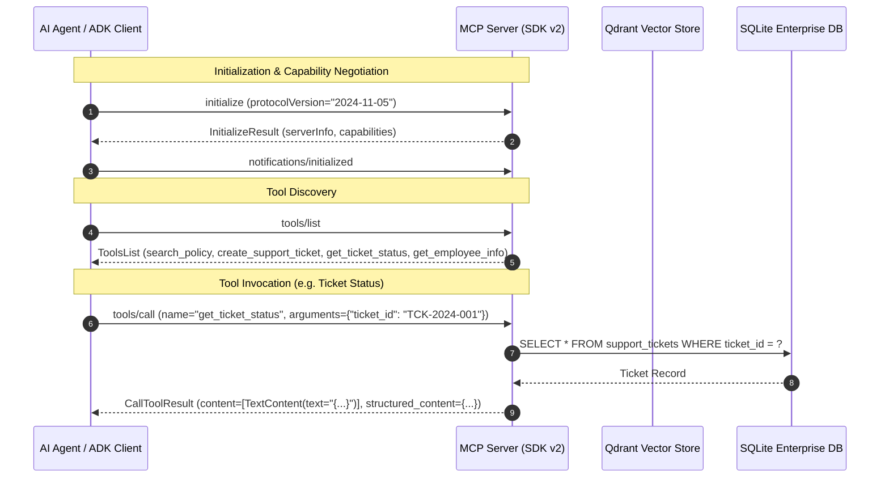

# Model Context Protocol (MCP) Server Architecture

## 1. Overview & Protocol Specification

The **Enterprise AI Knowledge & Support Agent** implements a full **Model Context Protocol (MCP)** server built on the **official MCP Python SDK v2** (`mcp>=2.2.0`).

MCP is an open standard that standardizes how AI applications (clients) discover, inspect, and invoke external tools and context providers (servers). Instead of hard-coding proprietary function-calling schemas into agent business logic, MCP uses standardized JSON-RPC 2.0 messages over structured transports.



---

## 2. Client / Server Separation & Security Boundaries

A central design principle of MCP is **strict decoupling between the AI model and internal enterprise services**:

1. **Isolation of Secrets and Connections**:
   - The LLM orchestrator never receives raw database connections, SQL query strings, or Qdrant API keys.
   - The MCP server encapsulates all database access, schema validations, and permission enforcement behind strongly-typed tool interfaces.

2. **Process and Network Decoupling**:
   - The MCP server operates as an independent service or isolated child subprocess.
   - Compromising the LLM prompt layer does not yield arbitrary database execution or file system access.

3. **Vendor Agnosticism**:
   - Any MCP-compliant client (Google Agent Development Kit, LangChain, Claude Desktop, Cursor, or custom FastAPI controllers) can interact with this server without code modifications.

---

## 3. Transport Layers

The MCP server supports two production-grade transport protocols:

### A. Standard I/O Transport (`stdio`) — Default
- **Mechanism**: The client launches `python scripts/run_mcp_server.py` as a subprocess and communicates via standard input (`stdin`) and standard output (`stdout`).
- **Log Isolation**: Diagnostic logging is directed exclusively to `sys.stderr` so that JSON-RPC payloads on `stdout` are never corrupted.
- **Use Case**: Local agent execution, Google ADK local CLI, Claude Desktop tool integration, and CI/CD test runners.

### B. Server-Sent Events Transport (`sse`) / HTTP
- **Mechanism**: An async HTTP server powered by Starlette/Uvicorn streaming JSON-RPC messages over HTTP POST and SSE channels.
- **Use Case**: Distributed enterprise deployments, multi-agent microservice architectures, and Dockerized Kubernetes sidecars.

---

## 4. Exposed Enterprise Tools

The MCP server exposes four enterprise tools:

### 1. `search_policy`
- **Description**: Searches enterprise policies, guidelines, and handbooks using semantic vector search.
- **Parameters**:
  - `query` (`string`, required): Natural language search query.
  - `department` (`string`, optional): Optional filter (e.g. `"HR"`, `"IT"`, `"Finance"`).
  - `top_k` (`integer`, optional, default `3`, range `1-10`): Number of chunks to return.
- **Backend**: Direct integration with `KnowledgeRetriever` and the Qdrant vector database.
- **Returns**: Structured list of matching policy chunks with file provenance, section headings, page numbers, and relevance scores.

### 2. `create_support_ticket`
- **Description**: Creates a new support ticket in the enterprise SQLite database.
- **Parameters**:
  - `employee_id` (`string`, required): Identifier of requesting employee (e.g. `"EMP-1001"`).
  - `title` (`string`, required): Summary title.
  - `description` (`string`, required): Detailed description of the issue.
  - `category` (`string`, required): One of `['IT', 'HR', 'FACILITIES', 'FINANCE', 'SECURITY', 'HARDWARE', 'GENERAL']`.
  - `priority` (`string`, optional, default `"MEDIUM"`): One of `['LOW', 'MEDIUM', 'HIGH', 'URGENT']`.
- **Validation**: Verifies employee existence in SQLite before transactional insertion. Rejects unknown employees or invalid categories.
- **Returns**: Created ticket payload including generated `ticket_id` (e.g. `TCK-2024-XXXX`).

### 3. `get_ticket_status`
- **Description**: Retrieves current status, priority, resolution notes, and timeline of an enterprise ticket.
- **Parameters**:
  - `ticket_id` (`string`, required): Ticket identifier (e.g. `"TCK-2024-001"`).
- **Backend**: Transactional lookup against the `support_tickets` SQLite table.
- **Returns**: Complete ticket state or structured error if not found.

### 4. `get_employee_info`
- **Description**: Looks up employee directory profile by employee ID or corporate email.
- **Parameters**:
  - `employee_id` (`string`, optional): Employee ID (e.g. `"EMP-1001"`).
  - `email` (`string`, optional): Corporate email (e.g. `"john.doe@company.com"`).
- **Validation**: Requires at least one parameter. Strictly omits internal secrets and passwords.
- **Returns**: Employee name, email, department, role, and active status.

---

## 5. Standalone Execution & Verification

### Running the Standalone MCP Server
```powershell
# Run with stdio transport (default)
python scripts/run_mcp_server.py

# Run with SSE/HTTP transport
python scripts/run_mcp_server.py --transport sse --port 8001
```

### Inspecting with Official MCP Inspector
You can verify the server interactively using the official Node.js MCP Inspector:

```powershell
npx @modelcontextprotocol/inspector python scripts/run_mcp_server.py
```

The inspector will launch an interactive web UI allowing you to inspect tool schemas and execute live calls against `search_policy`, `create_support_ticket`, `get_ticket_status`, and `get_employee_info`.

---

## 6. Automated Testing Strategy

The MCP implementation is validated using the official SDK v2 `ClientSession` over in-memory streams (`mcp.shared.memory.create_client_server_memory_streams`). This ensures:
1. Full JSON-RPC 2.0 protocol compliance without mocking the network layer.
2. Complete tool advertisement and schema inspection.
3. Live validation of success and error branches against the SQLite database and vector retriever.
